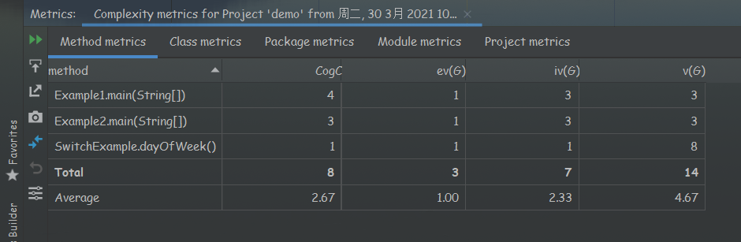

# metrics-lab

**Name:** 黎诗龙

**SID**:11811407

# Answers

## part1

The Cyclomatic complexity of the following classes:

| class name    | cyclomatic complexity |
| ------------- | --------------------- |
| Example1      | 3                     |
| Example2      | 3                     |
| SwitchExample | 8                     |

- How to calculate?
  - Number of predicates + 1
  - Number of edges - number of nodes + 2 
  - Number of regions of the flow graph

### part2

I choose [easyexcel](https://github.com/alibaba/easyexcel) for my part2 task.

- The Lines of Codes of easyexcel is 20,740.
- The maximum cyclomatic complexity of the classes is 89. (DataFormatter.java)

- Yes. The method with the most cyclomatic complexity has 35. Since the method is to transfer the date String to format date, there are many cases needed to consider.

