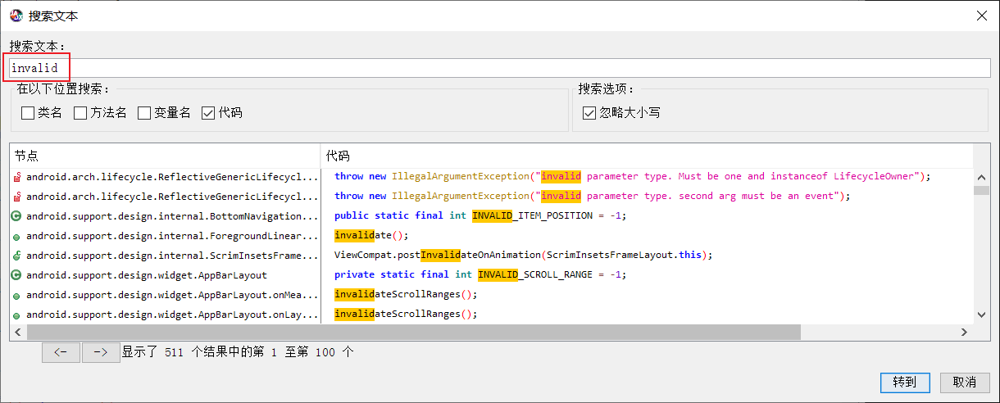
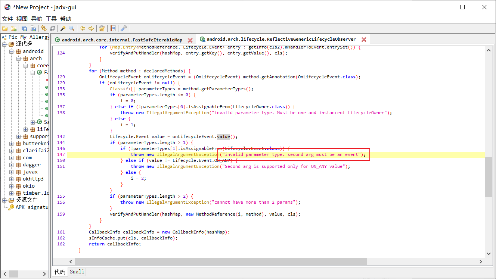

# reverseengineeringlab

**Name**: 黎诗龙

**SID**: 11811407

# Answers

- The string I have searched is "invalid", and I use the tool `jadx-gui` in windows.

  

- The location is here in the `android.arch.lifecycle.ReflectiveGenericLifecycleObersever`

