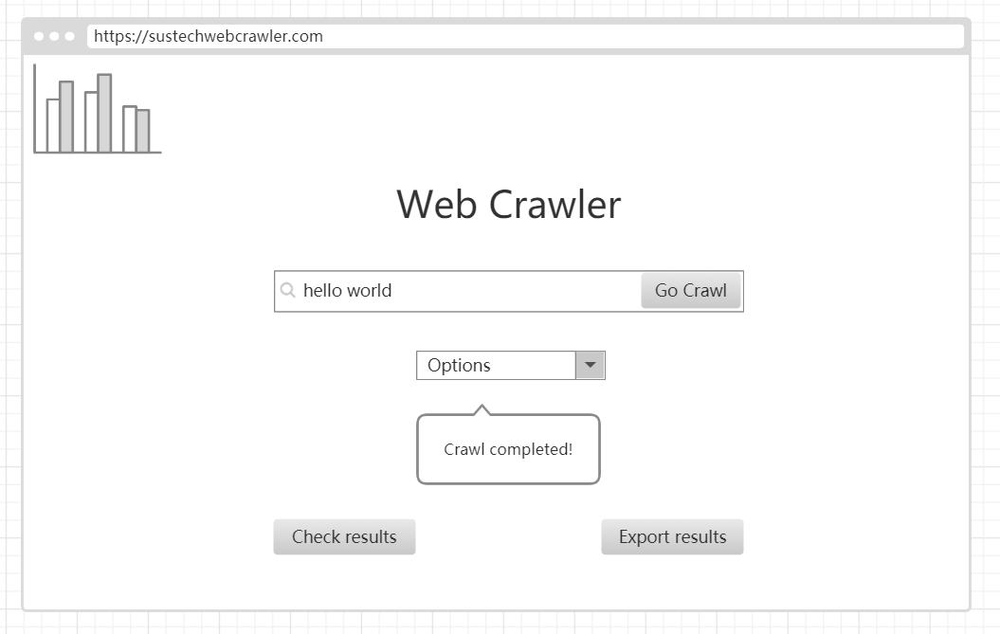
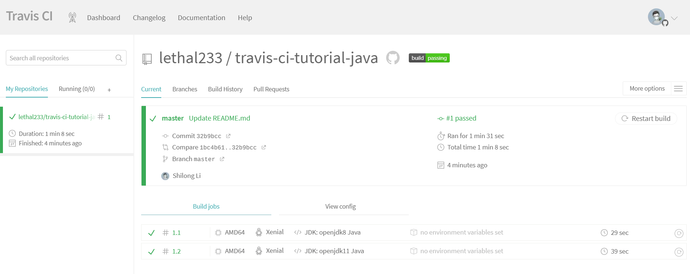

# Ui-ci-lab

**Name:** 黎诗龙

**SID:** 11811407

# Answers

## UI

2. I choose `Design a web crawler` question.

3. My UI design

   

4. It follows the rules

   User needs web crawler, and the query condition is on the middle of the page. It's accessible and simple to use. 

   The design of the page is clear and consistent.

   The `Crawl completed` message is unveiled when the query results return, which is a feedback.

   User can easily understand where and how to use it.


### CI

1. 

2. a) Yes. fastjson uses Travis CI, easyexcel uses Travis CI.

   b) fastjson:

```yaml
language: java
jdk:
  - openjdk8
before_install:
  - pip install --user codecov
after_success:
  - codecov
branches:
  except:
    - appveyor
```

​			easyexcel:

```yaml
language: java
jdk: openjdk8
cache:
  directories:
    - $HOME/.m2
before_install:
  - chmod +x mvnw
install:
  - ./mvnw install -B -V -Dmaven.test.skip=true
  - ./mvnw javadoc:javadoc
```

